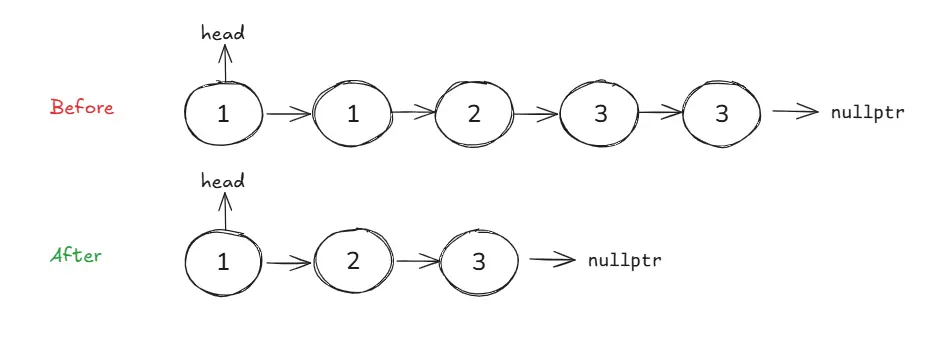
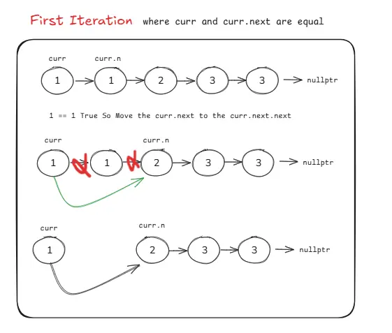
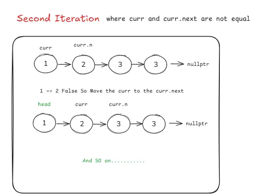
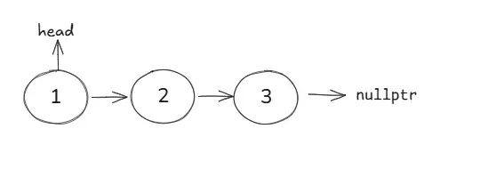

# Leetcode 83. Remove Duplicates from Sorted List


### Table of Content 


## Problem

Given the `head` of a sorted linked list, delete all duplicates such that each element appears only once. Return the linked list `sorted` as well.




#### Example 1:
```text
Input: head = [1,1,2]
Output: [1,2]
```
#### Example 2:
```text
Input: head = [1,1,2,3,3]
Output: [1,2,3]
``` 

### Constraints:

- The number of nodes in the list is in the range `[0, 300]`.
- `-100 <= Node.val <= 100`
- The list is guaranteed to be **sorted** in **ascending order**.
 

## Problem Understanding
You are given the **head** of a singly linked list that is already **sorted** in **ascending order**. Because the list is sorted, any duplicate values will always appear next to each other. The task is to remove these duplicate nodes so that each value appears only once, while keeping the list sorted. After removing duplicates, you must return the **original head** of the modified list.

## Key Observations
Since the linked list is **sorted**, duplicates can only exist in **consecutive nodes**. This property allows us to solve the problem efficiently by traversing the list once and comparing each node with its next node. There is no need for extra memory or data structures.

## Constraints Analysis
The list can contain between **0** and **300** nodes, and node values range from **-100 to 100**. These small constraints mean performance is not an issue, but the solution should still be clean and logically correct. The list being sorted is the most important constraint for simplifying the solution.

## Edge Cases
If the list is empty `(head == nullptr)`, there is nothing to remove, so return `nullptr`. If the list contains only one node, it cannot have duplicates, so return the head as-is. These checks prevent unnecessary traversal and avoid null pointer errors.

## My Approach (Step-by-Step)
Start traversing the list from the head using a temporary pointer. Continue traversal until the current node or its next node becomes null. At each step, compare the value of the current node with the value of the next node. If both values are the same, skip the next node by adjusting the pointer, effectively removing the duplicate. If the values are different, move the pointer forward normally. This process continues until the end of the list is reached, after which the head is returned.

## Why This Approach Works
Because the list is sorted, duplicates are guaranteed to be adjacent. This allows in-place modification of the list without additional memory. The approach maintains the original node order and ensures only unique values remain.

## Time and Space Complexity
The algorithm traverses the list once, resulting in **O(n)** time complexity, where `n` is the number of nodes. It uses constant extra space, so the space complexity is `O(1)`.

## Complete Code Implementation
```cpp
class Solution {
public:
    ListNode* deleteDuplicates(ListNode* head) {

        // Edge case: empty list or single node
        if (head == nullptr || head->next == nullptr) {
            return head;
        }

        ListNode* temp = head;

        // Traverse the list
        while (temp != nullptr && temp->next != nullptr) {
            if (temp->val == temp->next->val) {
                // Skip the duplicate node
                temp->next = temp->next->next;
            } else {
                // Move to next node if values are different
                temp = temp->next;
            }
        }

        return head;
    }
};
```
### Dry Run Example
**Input**
```text
1 → 1 → 2 → 3 → 3 → nullptr
```

- Start at first `1`, compare with next `1` → duplicate found → remove next
  
    

- List becomes:` 1 → 2 → 3 → 3`
- Move to `2`, compare with `3` → not duplicate → move forward
  
    

- Compare `3` with next `3` → duplicate found → remove next
- End of list reached

  
    

**Output**
```text
1 → 2 → 3 → nullptr
```


# Notes (Roman urdu Version)

### Problem

Aap ko ek sorted linked list ka head diya gaya hai. Aap ka task yeh hai ke saare duplicate elements remove kar dein taake har element sirf ek dafa appear ho. Aakhir mein linked list ko sorted form mein return karna hai.

### Problem Understanding

Aap ko ek singly linked list ka head diya gaya hai jo pehle se ascending order mein sorted hai. Kyun ke list sorted hai, is liye koi bhi duplicate values hamesha ek doosre ke sath (adjacent) hongi. Aap ka kaam yeh duplicates remove karna hai taake har value sirf ek martaba aaye, aur list ka order bhi maintain rahe. Duplicates remove karne ke baad, aap ko modified list ka original head return karna hai.

### Key Observations

Kyunkay linked list sorted hai, duplicates sirf consecutive nodes mein hi ho sakti hain. Is property ki wajah se hum problem ko efficiently solve kar sakte hain sirf ek dafa list traverse kar ke. Kisi bhi extra memory ya data structure ki zaroorat nahi hoti.

### Constraints Analysis

List mein 0 se 300 tak nodes ho sakte hain, aur node values -100 se 100 ke darmiyan hoti hain. Yeh constraints kaafi chhote hain, is liye performance ka masla nahi hota, lekin solution phir bhi clean aur logically correct hona chahiye. List ka sorted hona is problem ka sab se important constraint hai jo solution ko simple bana deta hai.

### Edge Cases

Agar list empty ho (head == nullptr), to remove karne ke liye kuch bhi nahi hota, is liye nullptr return kar dete hain. Agar list mein sirf ek node ho, to us mein duplicates ho hi nahi sakte, is liye head ko as-it-is return kar dete hain. Yeh checks unnecessary traversal se bachate hain aur null pointer errors ko avoid karte hain.

### My Approach (Step-by-Step)

List ke head se traversal start karte hain ek temporary pointer ki madad se. Traversal tab tak continue hoti hai jab tak current node ya us ka next node null na ho jaye. Har step par current node ki value ko next node ki value ke sath compare karte hain. Agar dono values same hon, to next node ko skip kar dete hain pointer adjust kar ke, jis se duplicate effectively remove ho jata hai. Agar values different hon, to pointer normally aage move kar deta hai. Yeh process list ke end tak continue hota hai, aur aakhir mein head return kar diya jata hai.

### Why This Approach Works

Kyunkay list sorted hoti hai, is liye duplicates hamesha adjacent hote hain. Is wajah se hum list ko in-place modify kar sakte hain bina kisi additional memory ke. Yeh approach original node order ko maintain karti hai aur ensure karti hai ke sirf unique values hi baqi rahen.

### Time and Space Complexity

Algorithm list ko sirf ek dafa traverse karta hai, jis ki wajah se time complexity O(n) hoti hai, jahan n nodes ki total tadaad hai. Extra space use nahi hoti, is liye space complexity O(1) hoti hai.
